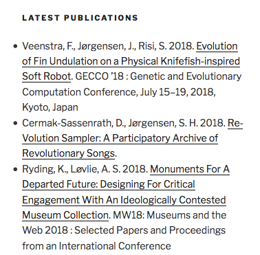

A widget for displaying feeds from Elsevier Pure in WordPress.

# Description

This widget offers a cleaned experience for [Elsevier Pure](https://www.elsevier.com/solutions/pure) feeds. Developed primarily for the [MAD Art and Design research group](https://pure.itu.dk/portal/en/organisations/mad-art--design(cf9b4e6a-e1ad-41e3-9475-7679abe7131b).html) at [IT University of Copenhagen](https://www.itu.dk).

Pure provides feeds which look like this

```xml
<?xml version="1.0" encoding="UTF-8"?>
<rss xmlns:dc="http://purl.org/dc/elements/1.1/" version="2.0">
  <channel>
    <title>Research database - IT-University of Copenhagen - RSS Feed</title>
    <link>https://pure.itu.dk/portal/en/organisations/mad-art--design(cf9b4e6a-e
1ad-41e3-9475-7679abe7131b)/publications.html</link>
    <description>RSS Feed</description>
    <pubDate>Tue, 07 Aug 2018 21:11:05 GMT</pubDate>
    <dc:date>2018-08-07T21:11:05Z</dc:date>
    <item>
      <title>Evolution of Fin Undulation on a Physical Knifefish-inspired Soft Robot</title>
      <link>https://pure.itu.dk/portal/en/publications/evolution-of-fin-undulation-on-a-physical-knifefishinspired-soft-robot(d057c748-3cf6-41f5-beee-da2df6785955).html</link>
      <description>&lt;div style='font-size: 9px;'&gt;&lt;div class="rendering rendering_researchoutput  rendering_researchoutput_short rendering_contributiontobookanthology rendering_short rendering_contributiontobookanthology_short"&gt;&lt;h2 class="title"&gt;&lt;a rel="ContributionToBookAnthology" href="https://pure.itu.dk/portal/en/publications/evolution-of-fin-undulation-on-a-physical-knifefishinspired-soft-robot(d057c748-3cf6-41f5-beee-da2df6785955).html" class="link"&gt;&lt;span&gt;Evolution of Fin Undulation on a Physical Knifefish-inspired Soft Robot&lt;/span&gt;&lt;/a&gt;&lt;/h2&gt;&lt;a rel="Person" href="https://pure.itu.dk/portal/en/persons/frank-veenstra(9a791ca8-3e23-406e-b089-5b6fab54cc0f).html" class="link person"&gt;&lt;span&gt;Veenstra, F.&lt;/span&gt;&lt;/a&gt;, &lt;a rel="Person" href="https://pure.itu.dk/portal/en/persons/jonas-joergensen(8758dd24-d86a-4dab-be44-fa4e9e903141).html" class="link person"&gt;&lt;span&gt;Jørgensen, J.&lt;/span&gt;&lt;/a&gt; &amp;amp; &lt;a rel="Person" href="https://pure.itu.dk/portal/en/persons/sebastian-risi(a420ffb3-2ca6-4925-a25f-baaa5228fc15).html" class="link person"&gt;&lt;span&gt;Risi, S.&lt;/span&gt;&lt;/a&gt; &lt;span class="date"&gt;15 Jul 2018&lt;/span&gt; &lt;em&gt;GECCO ’18: Genetic and Evolutionary Computation Conference, July 15–19, 2018, Kyoto, Japan.&lt;/em&gt; Sartor, J. B., D’Hondt, T. &amp;amp; De Meuter, W. (eds.). New York, NY. USA: &lt;a rel="Publisher" href="https://pure.itu.dk/portal/en/publishers/association-for-computing-machinery(93a6474f-c5a7-4d0c-a5e2-d918992e91b9).html" class="link"&gt;&lt;span&gt;Association for Computing Machinery&lt;/span&gt;&lt;/a&gt;, &lt;span class="numberofpages"&gt;8 p.&lt;/span&gt;&lt;p class="type"&gt;&lt;span class="type_family"&gt;Research output&lt;span class="type_family_sep"&gt;: &lt;/span&gt;&lt;/span&gt;&lt;span class="type_classification_parent"&gt;Conference Article in Proceeding or Book/Report chapter&lt;span class="type_parent_sep"&gt; › &lt;/span&gt;&lt;/span&gt;&lt;span class="type_classification"&gt;Article in proceedings&lt;/span&gt;&lt;span class="type_classification"&gt;&lt;span class="type_parent_sep"&gt; › &lt;/span&gt;Research&lt;/span&gt;&lt;span class="type_classification"&gt;&lt;span class="type_parent_sep"&gt; › &lt;/span&gt;peer-review&lt;/span&gt;&lt;/p&gt;&lt;/div&gt;&lt;div class="rendering rendering_researchoutput  rendering_researchoutput_detailsportal rendering_contributiontobookanthology rendering_detailsportal rendering_contributiontobookanthology_detailsportal"&gt;&lt;div class="abstract"&gt;&lt;div class="textblock"&gt;Soft robotics is a growing field of research and one of its challenges is how to efficiently design a controller for a soft morphology.&lt;br /&gt;This paper presents a marine soft robot inspired by the ghost knifefish that swims on the water surface by using an undulating fin underneath its body. &lt;br /&gt;We investigate how propagating wave functions can be evolved and how these affect the swimming performance of the robot. &lt;br /&gt;The fin and body of the robot are constructed from silicone and six wooden fin rays actuated by servo motors. &lt;br /&gt;In order to bypass the reality gap, which would necessitate a complex simulation of the fish, we implemented a Covariance Matrix Adaptation Evolution Strategy (CMA-ES) directly on the physical robot to optimize its controller for travel speed. &lt;br /&gt;Our results show that evolving a simple sine wave or a Fourier series can generate controllers that outperform a hand programmed controller. &lt;br /&gt;The results additionally demonstrate that the best evolved controllers share similarities with the undulation patterns of actual knifefish. &lt;br /&gt;Based on these results we suggest that evolution on physical robots is promising for future application in optimizing behaviors of soft robots.&lt;/div&gt;&lt;/div&gt;&lt;div class="conference"&gt;&lt;table class="properties"&gt;&lt;tbody&gt;&lt;tr class="language"&gt;&lt;th&gt;Original language&lt;/th&gt;&lt;td&gt;English&lt;/td&gt;&lt;/tr&gt;&lt;tr&gt;&lt;th&gt;Title of host publication&lt;/th&gt;&lt;td&gt;GECCO ’18 : Genetic and Evolutionary Computation Conference, July 15–19, 2018, Kyoto, Japan&lt;/td&gt;&lt;/tr&gt;&lt;tr&gt;&lt;th&gt;Editors&lt;/th&gt;&lt;td&gt;Jennifer B.  Sartor, Theo D’Hondt, Wolfgang De Meuter&lt;/td&gt;&lt;/tr&gt;&lt;tr&gt;&lt;th&gt;Number of pages&lt;/th&gt;&lt;td&gt;8&lt;/td&gt;&lt;/tr&gt;&lt;tr&gt;&lt;th&gt;Place of Publication&lt;/th&gt;&lt;td&gt;New York, NY. USA&lt;/td&gt;&lt;/tr&gt;&lt;tr&gt;&lt;th&gt;Publisher&lt;/th&gt;&lt;td&gt;&lt;a rel="Publisher" href="https://pure.itu.dk/portal/en/publishers/association-for-computing-machinery(93a6474f-c5a7-4d0c-a5e2-d918992e91b9).html" class="link"&gt;&lt;span&gt;Association for Computing Machinery&lt;/span&gt;&lt;/a&gt;&lt;/td&gt;&lt;/tr&gt;&lt;tr&gt;&lt;th&gt;Publication date&lt;/th&gt;&lt;td&gt;&lt;span class="date"&gt;15 Jul 2018&lt;/span&gt;&lt;/td&gt;&lt;/tr&gt;&lt;tr class="isbn-print"&gt;&lt;th&gt;ISBN (Print)&lt;/th&gt;&lt;td&gt;978-1-4503-5618-3&lt;/td&gt;&lt;/tr&gt;&lt;tr class="digital_object_identifiers"&gt;&lt;th&gt;DOIs&lt;/th&gt;&lt;td&gt;&lt;ul class="relations digital_object_identifiers"&gt;&lt;li&gt;&lt;a onclick="window.open(this.href); return false;" href="https://doi.org/10.1145/3205455.3205583" class="link"&gt;&lt;span&gt;10.1145/3205455.3205583&lt;/span&gt;&lt;/a&gt; &lt;/li&gt;&lt;/ul&gt;&lt;/td&gt;&lt;/tr&gt;&lt;tr class="status"&gt;&lt;th&gt;State&lt;/th&gt;&lt;td&gt;&lt;span class="prefix"&gt;Published - &lt;/span&gt;&lt;span class="date"&gt;15 Jul 2018&lt;/span&gt;&lt;/td&gt;&lt;/tr&gt;&lt;/tbody&gt;&lt;/table&gt;&lt;/div&gt;&lt;/div&gt;&lt;/div&gt;</description>
      <enclosure url="https://pure.itu.dk/portal/files/83217349/evolution_fin_undulation_postprint.pdf" />
      <pubDate>Sun, 15 Jul 2018 00:00:00 GMT</pubDate>
      <guid isPermaLink="false">https://pure.itu.dk/portal/en/publications/evolution-of-fin-undulation-on-a-physical-knifefishinspired-soft-robot(d057c748-3cf6-41f5-beee-da2df6785955).html</guid>
      <dc:date>2018-07-15T00:00:00Z</dc:date>
    </item>
```

The problem is that the `/rss/channel/item/description` nodes are rendered HTML, a tag soup 🍜

This WordPress plugin parses parts of it, builds a simple object model, and exposes it as an admittedly rudimentary WordPress widget.



# Installation

The usual WordPress thing.

# Configuration

See the usual WordPress administration panel.

# Feedback is welcome

Please create issues and pull requests, or if you are at ITU, come have a chat.
