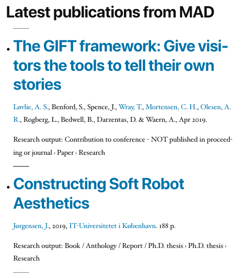

A widget for listing academic publications from Elsevier Pure in WordPress.

# Description

This widget displays publications from [Elsevier Pure](https://www.elsevier.com/solutions/pure) institutional repositories. Compared to the RSS feeds, this hopes to provide a cleaner and more configurable output of publications.

Pure offers rendering items in various bibliographical style. Below is example output with the [APA style](https://apastyle.apa.org/) style, without any fancy CSS.


Example output with the *short* style.



# Installation

Install as usual for WordPress plugins.

# Configuration

After installing and enabling as usual for WordPress plugins, PURE API URL is needed, together with API key which you can acquire from the Pure administrator. Additionally organisation ID is needed to filter publications. You can find there on the Pure website, e.g. the Pure page of MAD Art & Design at IT University of Copenhagen is https://pure.itu.dk/portal/en/organisations/mad-art--design(cf9b4e6a-e1ad-41e3-9475-7679abe7131b).html, and the organisation ID is `cf9b4e6a-e1ad-41e3-9475-7679abe7131b`. Enter these in the widget configuration, and select a bibliographical style, typically perhaps APA or Vancouver.

This widget has no opinion about styling. From this example HTML structure, in the APA style you can see the CSS ids and classes.

```html
<section id="pure_widget-5" class="widget pure_widget">
    <h2 class="widget-title">Latest publications from MAD</h2>
        <ul class="references">
            <li class="item">
                <div class="rendering rendering_researchoutput  rendering_researchoutput_apa rendering_contributiontoconference rendering_apa rendering_contributiontoconference_apa">
                    <a rel="Person" href="https://pure.itu.dk/portal/en/persons/anders-sundnes-loevlie(22ec9269-2fff-4dbf-a9c7-5037559a15ee).html" class="link"><span>Løvlie, A. S.</span></a>,
                    Benford, S., Spence, J.
                    <a rel="Person" href="https://pure.itu.dk/portal/en/persons/tim-wray(f90a0487-b539-4132-82a4-4aee76dbfe52).html" class="link"><span>, Wray, T.</span></a>
                    <a rel="Person" href="https://pure.itu.dk/portal/en/persons/christian-hviid-mortensen(11d33701-c7dd-437f-a515-fc14c8092775).html" class="link"><span>, Mortensen, C. H.</span></a>
                    <a rel="Person" href="https://pure.itu.dk/portal/en/persons/anne-roerbaek-olesen(2f83eb23-3f43-4213-9ea4-78f9ebb11b05).html" class="link"><span>, Olesen, A. R.</span></a>,
                    ...
                    Waern, A.
                    (2019).
                    <a rel="ContributionToConference" href="https://pure.itu.dk/portal/en/publications/the-gift-framework-give-visitors-the-tools-to-tell-their-own-stories(c9fcf3d7-2076-4c73-ac05-95d98a122e7d).html" class="link"><span><em>The GIFT framework: Give visitors the tools to tell their own stories</em></span></a>.
                    Paper presented at MuseWeb 2019, Boston, United States.
                </div>
            </li>
            <li class="item">
                <div class="rendering rendering_researchoutput  rendering_researchoutput_apa rendering_bookanthology rendering_apa rendering_bookanthology_apa">
                    <a rel="Person" href="https://pure.itu.dk/portal/en/persons/jonas-joergensen(8758dd24-d86a-4dab-be44-fa4e9e903141).html" class="link"><span>Jørgensen, J.</span></a>
                    (2019).
                    <a rel="BookAnthology" href="https://pure.itu.dk/portal/en/publications/constructing-soft-robot-aesthetics(1f3ae4b4-056c-4a8b-8c02-b9237d51d8a0).html" class="link"><span><em>Constructing Soft Robot Aesthetics</em></span></a>.
                    IT-Universitetet i København.
                </div>
            </li>
            .
            .
            .
        </ul>
</section>
```

ie the most interesting, widget-specific CSS ids and classes are

```css
.pure_widget
    .widget-title
        .references
            .item
                .rendering .rendering_researchoutput ...
```

# Feedback is welcome

The primary intented use scenario is to list newest publications in a widget on a webpage of a research group or lab or other organizational unit. Developed primarily for the [MAD Art and Design research group](https://pure.itu.dk/portal/en/organisations/mad-art--design(cf9b4e6a-e1ad-41e3-9475-7679abe7131b).html) at [IT University of Copenhagen](https://www.itu.dk).

Please create issues and pull requests on GitHub, or if you are at ITU, come have a chat :)
