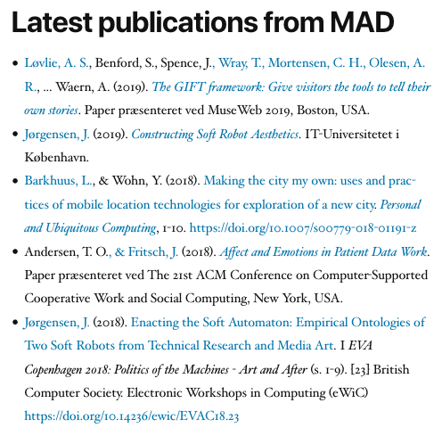

A widget for displaying feeds from Elsevier Pure in WordPress.

# Description

This widget displays publications from [Elsevier Pure](https://www.elsevier.com/solutions/pure) institutional repositories. Compared to the RSS feeds, this hopes to provide a cleaner and more configurable output of publications.

Pure offers rendering items in various bibliographical style. Below is example output with the [APA style](https://apastyle.apa.org/) style, without any fancy CSS.

Example output with the *short* style.

# Installation

Install as usual for WordPress plugins.

# Configuration

After installing and enabling as usual for WordPress plugins, PURE API URL is needed, together with API key which you can acquire from the Pure administrator. Additionally organisation ID is needed to filter publications. You can find there on the Pure website, e.g. the Pure page of MAD Art & Design at IT University of Copenhagen is https://pure.itu.dk/portal/en/organisations/mad-art--design(cf9b4e6a-e1ad-41e3-9475-7679abe7131b).html, and the organisation ID is 'cf9b4e6a-e1ad-41e3-9475-7679abe7131b'. Enter these in the widget configuration, and select a bibliographical style, typically perhaps APA or Vancouver.

# Feedback is welcome

The primary intented use scenario is to list newest publications in a widget on a webpage of a research group or lab or other organizational unit. Developed primarily for the [MAD Art and Design research group](https://pure.itu.dk/portal/en/organisations/mad-art--design(cf9b4e6a-e1ad-41e3-9475-7679abe7131b).html) at [IT University of Copenhagen](https://www.itu.dk).

Please create issues and pull requests, or if you are at ITU, come have a chat.
